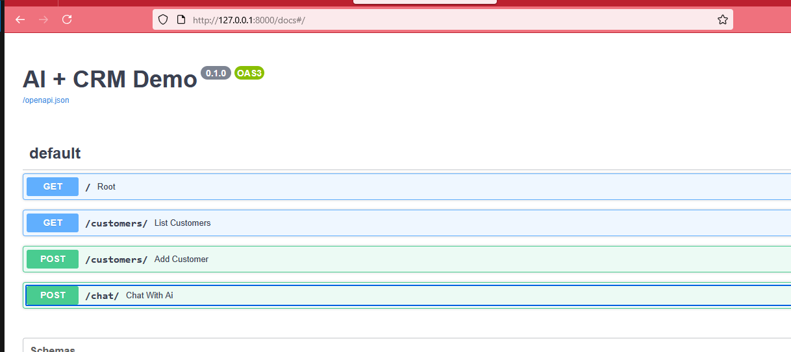

# CRM API Service


A lightweight **CRM API Service** built with Python.
It provides CRUD operations, database management, and an AI service integration.

---

## 🚀 Features
- ✅ **Fast and lightweight** backend
- ✅ **SQLite database** for simple storage
- ✅ **CRUD operations** for managing data
- ✅ **Modular architecture** (`models`, `schemas`, `crud`)
- ✅ **AI service integration** via `ai_service.py`

---

## 📂 Project Structure

```
├── main.py            # Entry point for the API
├── ai_service.py      # AI-related services
├── crud.py            # CRUD operations
├── database.py        # Database configuration
├── models.py          # ORM models
├── schemas.py         # Pydantic schemas
├── crm.db             # SQLite database file
├── requirements.txt   # Dependencies list
├── .gitignore
└── image.png
```

---

## 🛠️ Installation & Setup

1. **Clone the repository**
   ```bash
   git clone <https://github.com/raminok/AI.git>
   cd CRM
   ```

2. **Create and activate a virtual environment**
   ```bash
   python -m venv venv
   source venv/bin/activate   # Linux/Mac
   venv\Scripts\activate      # Windows
   ```

3. **Install dependencies**
   ```bash
   pip install -r requirements.txt
   ```

4. **Run the application**
   ```bash
   python main.py
   ```
   or if using FastAPI:
   ```bash
   uvicorn main:app --reload
   ```

---

## 📖 Usage

- Access the API at:
  ```
  http://127.0.0.1:8000
  ```
- Interactive API docs available at:
  ```
  http://127.0.0.1:8000/docs
  ```

---

## 🗄️ Database

- Default database: **SQLite (`crm.db`)**
- Can be replaced with MySQL/PostgreSQL by editing `database.py`.

---

## 🤖 AI Service

The `ai_service.py` module provides AI-related features that can be integrated into the CRM workflow.


---

## 📜 License

This project is licensed under the **MIT License** – feel free to use and modify it.

---

### ✨ Author
❤️ Developed with **Ramin Orak 2024**
